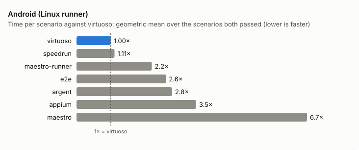
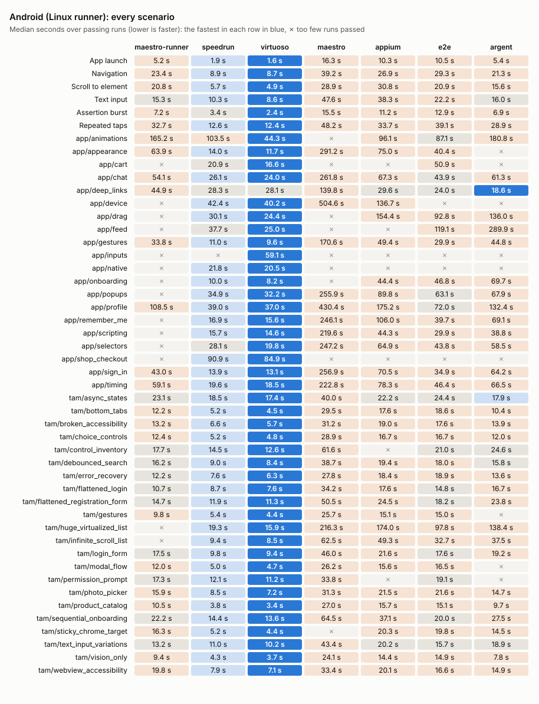
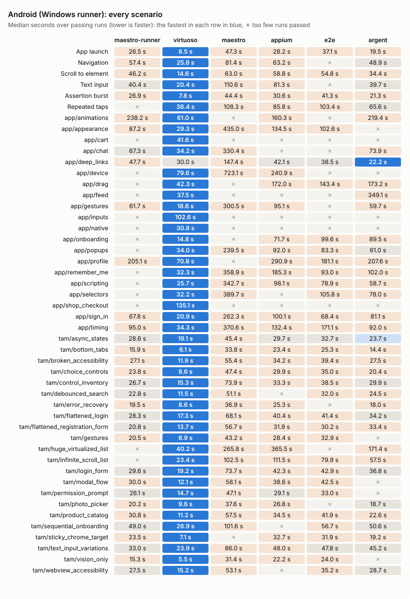
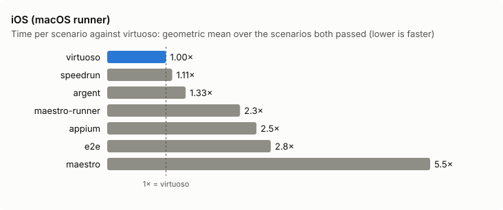
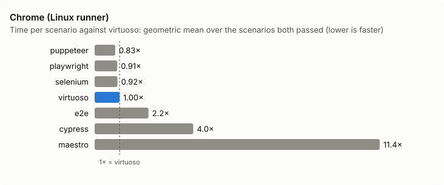
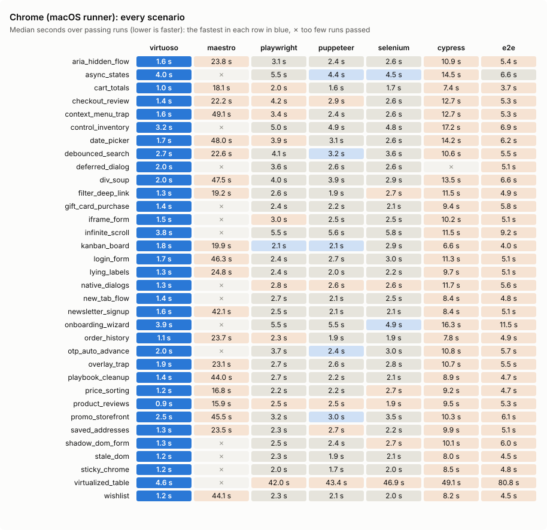
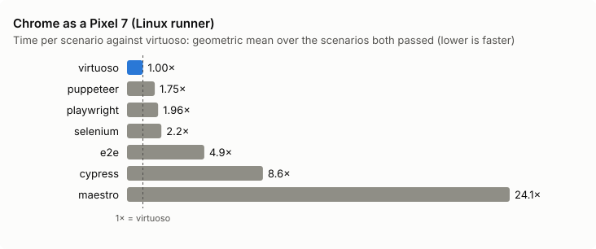
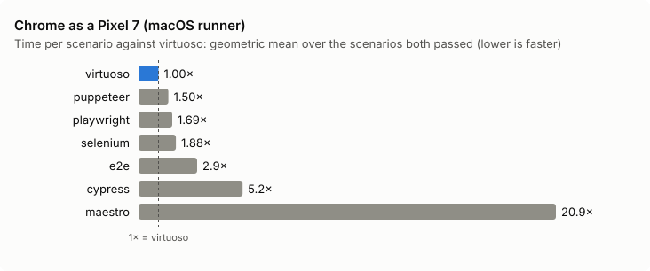

# virtuoso

[](https://github.com/marksmayo/virtuoso/actions/workflows/ci.yml)
[](LICENSE)
[](https://www.rust-lang.org)
[](#benchmark)
[](https://github.com/mobile-dev-inc/maestro)
[](https://app.codspeed.io/marksmayo/virtuoso?utm_source=badge)

A 2.2 MB, Maestro-compatible end-to-end test runner for Android, iOS, and Chrome, written in Rust.
One binary with its device agents built in—waiting for the app to settle instead of sleeping on the
clock, and reading the accessibility/DOM tree without screenshots.

### At a glance (Android on Linux CI, median of 5 runs)

| Metric | Maestro (JVM) | maestro-runner (Go) | speedrun | **virtuoso (Rust)** |
|---|---:|---:|---:|---:|
| **Install size** | 361.5 MB | 49.5 MB | 3.7 MB | **2.2 MB** |
| **One-command flow (connect + run)** | 13.54 s | 3.47 s | 1.32 s | **0.47 s** |
| **Core suite (sum of medians)** | 198.01 s | 100.00 s | 43.10 s | **38.80 s** |
| **Peak host memory** | 654.6 MB | 26.9 MB | 5.8 MB | **4.6 MB** |
| **App flows passed** | 60% | 40% | 95% | **100%** |

*(Full methodology, Windows/macOS runners, and 186 individual scenario metrics in [Benchmark](#benchmark).)*

```yaml
appId: com.example.app
---
- launchApp
- tapOn: "Sign in"
- inputText: "user@example.com"
- tapOn: "Continue"
- assertVisible: "Welcome"
```

```sh
virtuoso test flows/                                   # a folder, as `maestro test` takes it
virtuoso test login.yaml -e PASSWORD=secret --format junit --output report.xml
virtuoso --device emulator-5554,emulator-5556 test flows/ --shard-split 2
virtuoso lint flows/                                   # check flows without a device
virtuoso hierarchy                                     # what is on screen now
virtuoso test flows/ --app-file app.apk --video --format allure
virtuoso test flows/ --continuous                      # run again on every change
virtuoso --auto-start-emulator test flows/             # boot an AVD when nothing is connected
virtuoso --platform web test web-flows/                # a headless Chrome (url: in the flow)
virtuoso --platform web --emulate pixel-7 test web-flows/  # the same, as a phone (size, touch, UA)
virtuoso --platform web --device android test web-flows/  # Chrome on an Android device, over adb
virtuoso session start --app com.example.app           # drive an app a command at a time:
virtuoso do launchApp 'tapOn: Sign in' && virtuoso look  #   run commands, read the screen
virtuoso session save flows/sign-in.yaml               #   the commands that passed, as a flow
virtuoso doctor | virtuoso latency | virtuoso skills       # toolchain check, agent round trips, AI skill
```

## What it supports

The Maestro flow format: every command a Maestro Android flow uses (taps, text, swipes,
scrolling, assertions, app control, links, keys, clipboard, screenshots and visual assertions,
recordings, location and travel, orientation, permissions, media, airplane and dark mode,
`runFlow` (with maestro-runner's `else`), `repeat`, `retry`, scripts) plus maestro-runner's
`wait`, `runShell`, `dragAndDrop`, `openNotifications`, `acceptAlert` and `dismissAlert`; every
selector (text and id regexes with the full syntax, index, states, relative positions,
hierarchy, size, traits), `${...}` JavaScript expressions on QuickJS with `http` (multipart
forms too), `faker` and `require()`, `config.yaml` with globs, tags and execution order, hooks,
JUnit / HTML / JSON / Allure reports, videos, variable values masked in reports, sharding across
devices, and a restart of the device agent if it dies mid-run. `bench/features.json` lists every feature, against maestro-runner and
speedrun, with the reason behind each partial or missing one.

Android devices and emulators, iOS simulators (`--platform ios`, on a Mac with Xcode; not real
iPhones yet), and web pages in Chrome (`--platform web`, headless unless `--headed`). Runs on Windows (natively), Linux and macOS. On iOS, what a simulator does not
have is not supported, as in Maestro: airplane mode, the Back key, the volume keys; the camera and
notification permissions are the app's to ask for (simctl cannot set them).

On the web a flow names its page with `url:` where a phone flow has `appId:`, and selectors match
as in Maestro's web mode: `id` is the element's `id`, else its `data-testid`; text is the
element's own text (text inside an inline tag is that tag's), a field's value or its placeholder.
`launchApp` opens the page in a fresh tab (`clearState` first forgets the site's cookies and
storage), a swipe is the mouse wheel, `dragAndDrop` a mouse drag (HTML5 drag and drop too), and
the browser's dialogs, the tabs a page opens, frames (from another origin too) and open shadow
roots are on the screen like the rest. `setLocation`, `setPermissions`, dark mode, airplane mode
(offline), `setOrientation` (the viewport turned) and screenshots work; a recording needs ffmpeg
on the PATH. `--device` is `chrome`, a browser's path, or `ws://...` to drive one already
running. What a page has no use for (the volume keys, notifications, media) is not supported.

## How it works

- `agent/android` — a small Java agent (no Gradle: `javac` + `d8`, built by `build.rs` and
  embedded in the binary). It runs as the shell user through `app_process`, reads every
  window's accessibility tree through a hidden `UiAutomation`, injects input straight into the
  input manager, runs device commands without an adb round trip, and tells when the UI has
  settled (accessibility events going quiet, a main-thread idle probe, and a stable-tree
  check for screens that never stop animating). It speaks length-prefixed JSON over one TCP
  connection through `adb forward`, after a per-run token.
- `agent/ios` — the iOS agent: an XCUITest bundle (Swift) that the binary carries as source and
  builds for the simulator on first use. It serves the same protocol as the Android agent on
  the simulator's (shared) network, sends the screen in the same node format, and answers taps,
  drags, keys and text through XCUITest; the host does the rest with `xcrun simctl` (links,
  location, permissions, media, dark mode, video, clipboard, keychain).
- The web has no agent: virtuoso drives Chrome over its DevTools Protocol, on a WebSocket client
  of its own (`websocket`, `chrome`). The screen is one script run in the page (`web_screen.js`);
  a settle waits on a second, installed before each page's own scripts (`web_tracker.js`), that
  knows the last DOM change, the requests in flight, the short timers and the animations running.
- `crates/virtuoso` — the host: flow parser (`flow`), selector matching (`select`), the runner
  (`runner`, against a `Device` trait), the Android device (`android`, `android_device`), the
  iOS simulator (`ios`), the web (`web`),
  JavaScript (`js`), suites (`workspace`), reports (`report`) and the CLI (`main`).
- `crates/virtuoso-bench` — the benchmark harness and the HTML medal report.

## Building

You need Rust, a JDK (17+) and the Android SDK (`ANDROID_HOME`, with a platform and
build-tools). Then:

```sh
cargo build --release          # target/release/virtuoso, agent included
```

Without a JDK or SDK the binary builds with no agent and refuses Android devices.
`VIRTUOSO_AGENT_JAR=<path>` embeds an agent built elsewhere (cross builds).

For iOS, nothing more at build time: on a Mac with Xcode, the first `--platform ios` run
builds the iOS agent for the simulator (about a minute) into `~/Library/Caches/virtuoso` and
keeps it until the agent changes. `VIRTUOSO_IOS_AGENT=<path>` uses one built elsewhere (its
`.xctestrun`). The agent's Xcode project is generated from `agent/ios/project.yml` with
XcodeGen and committed; CI checks the two match.

## Tests

Every feature was built test first (red, then green). Most tests need no device: the runner
runs against a scripted `FakeDevice` (`crates/virtuoso/src/testing.rs`), the parser and
selectors against literals. Tests that need a real device or emulator pass trivially unless
`VIRTUOSO_DEVICE` names one:

```sh
cargo test --workspace                                            # no device needed
VIRTUOSO_DEVICE=emulator-5554 cargo test -p virtuoso -- --test-threads=1   # also on a device
```

The iOS tests need a booted simulator with the fixture app (`agent/ios/Fixture`) installed:
`VIRTUOSO_IOS_DEVICE=<udid> cargo test -p virtuoso --test device_ios --test ios_flows --
--test-threads=1`. GitHub Actions runs them on a macOS runner for every push
(`.github/workflows/ios.yml`): it boots a simulator, builds the fixture app, and lets virtuoso
build its agent as it would on any Mac.

`VIRTUOSO_DEBUG=1` traces every agent call with its time.

The host-side hot paths (flow parsing, screen replies, selectors, `${...}` expansion, PNG
decode/compare) have micro-benchmarks in `crates/virtuoso-benches/benches/core.rs`, tracked on every
push and pull request by [CodSpeed](https://app.codspeed.io/marksmayo/virtuoso)
(`.github/workflows/codspeed.yml`):

```sh
cargo bench -p virtuoso --bench core
```

## Benchmark

`virtuoso-bench` runs the same flows with each tool — virtuoso, maestro-runner, speedrun,
Maestro, Appium, Tester Army's e2e and Software Mansion's Argent — resets the device before
every run, and writes a results file; `virtuoso-bench report` turns it into a self-contained
HTML page with the medal tables. Three sets of flows: `bench/flows` against Android's Settings
app, speedrun's own benchmark app, and Tester Army's mobile benchmark app (`bench/tam-flows`).
See [docs/benchmark.md](docs/benchmark.md) for the metrics and how to run it.

```sh
cargo build --release -p virtuoso -p virtuoso-bench
target/release/virtuoso-bench run --iterations 5 --out bench/results/results.json
target/release/virtuoso-bench report bench/results/results.json --out report/index.html
```

The results below (between the `benchmark` markers) come from GitHub Actions runs, one field per
platform and host, every tool measured together on the same device: `virtuoso-bench readme
--field <name>=<results.json>... --charts docs/bench` writes them and their charts. A metric is
a medal event of its own in each field, so a tool that wins on one platform and loses on another
shows it.

### Latest results

<!-- benchmark:start -->
Each of the 185 performance events and 55 features is a medal event. A performance metric is an event of its own on each platform and host (Android (Linux runner), Android (Windows runner), iOS (macOS runner)), so a tool that wins on one and not another shows it. Written by `virtuoso-bench readme`, from GitHub Actions runs.

**Overall**

| Tool | 🥇 | 🥈 | 🥉 | Total |
|---|---:|---:|---:|---:|
| [virtuoso](https://github.com/marksmayo/virtuoso) | 199 | 17 | 5 | 221 |
| [speedrun](https://github.com/hubastard/speedrun) | 45 | 73 | 6 | 124 |
| [maestro-runner](https://github.com/devicelab-dev/maestro-runner) | 37 | 26 | 56 | 119 |
| [maestro](https://github.com/mobile-dev-inc/maestro) | 25 | 6 | 7 | 38 |
| [argent](https://github.com/software-mansion/argent) | 12 | 28 | 35 | 75 |
| [e2e](https://github.com/tester-army/e2e) | 4 | 8 | 39 | 51 |
| [appium](https://github.com/appium/appium) | 3 | 5 | 20 | 28 |

**Performance**

| Tool | 🥇 | 🥈 | 🥉 | Total |
|---|---:|---:|---:|---:|
| [virtuoso](https://github.com/marksmayo/virtuoso) | 155 | 17 | 5 | 177 |
| [speedrun](https://github.com/hubastard/speedrun) | 23 | 72 | 4 | 99 |
| [argent](https://github.com/software-mansion/argent) | 12 | 28 | 35 | 75 |
| [e2e](https://github.com/tester-army/e2e) | 4 | 8 | 39 | 51 |
| [appium](https://github.com/appium/appium) | 3 | 5 | 20 | 28 |
| [maestro-runner](https://github.com/devicelab-dev/maestro-runner) | 2 | 25 | 53 | 80 |
| [maestro](https://github.com/mobile-dev-inc/maestro) | 2 | 3 | 3 | 8 |

### Android (Linux runner)



emulator-5554: sdk_gphone64_x86_64 Android 16 (API 36), x86_64 emulator, software GPU (SwiftShader); GitHub ubuntu-latest runner (4 vCPU, 16 GB), Android emulator on KVM.

| Tool | 🥇 | 🥈 | 🥉 | Total |
|---|---:|---:|---:|---:|
| [virtuoso](https://github.com/marksmayo/virtuoso) | 56 | 4 | 1 | 61 |
| [speedrun](https://github.com/hubastard/speedrun) | 9 | 47 | 2 | 58 |
| [e2e](https://github.com/tester-army/e2e) | 3 | 2 | 20 | 25 |
| [argent](https://github.com/software-mansion/argent) | 3 | 1 | 10 | 14 |
| [maestro-runner](https://github.com/devicelab-dev/maestro-runner) | 1 | 1 | 22 | 24 |
| [maestro](https://github.com/mobile-dev-inc/maestro) | 1 | 1 | 0 | 2 |
| [appium](https://github.com/appium/appium) | 1 | 0 | 3 | 4 |



<details><summary>Every metric's scores</summary>

| Metric | maestro-runner | speedrun | virtuoso | maestro | appium | e2e | argent |
|---|---:|---:|---:|---:|---:|---:|---:|
| Install size | 49.5 MB | 3.7 MB | **2.4 MB** | 361.5 MB | 147.7 MB | 42.8 MB | 243.4 MB |
| CLI start (--version) | 7 ms | 1 ms | **1 ms** | 2084 ms | 457 ms | 26 ms | 30 ms |
| Invalid flow reported | 8 ms | 1 ms | **1 ms** | 2083 ms | — | — | 158 ms |
| One-command flow (connect + run) | 2.35 s | 1.16 s | **0.50 s** | 11.75 s | 12.03 s | 7.78 s | 1.10 s |
| App launch | 6.06 s | 2.52 s | **2.07 s** | 15.46 s | 10.83 s | 11.83 s | 5.60 s |
| Navigation | 19.27 s | 8.17 s | **7.64 s** | 36.53 s | 25.52 s | 26.78 s | 20.83 s |
| Scroll to element | 17.12 s | 5.12 s | **4.75 s** | 26.63 s | 29.73 s | 20.06 s | 14.75 s |
| Text input | 14.46 s | 10.14 s | **7.54 s** | 49.26 s | 37.49 s | 21.99 s | 14.83 s |
| Assertion burst | 7.55 s | 2.93 s | **2.25 s** | 17.96 s | 11.76 s | 13.76 s | 6.91 s |
| Repeated taps | 25.66 s | **11.02 s** | **11.05 s** | 47.95 s | 31.89 s | 34.37 s | 26.61 s |
| Whole suite (sum of medians) | 90.11 s | 39.90 s | **35.29 s** | 193.78 s | 147.21 s | 128.80 s | 89.53 s |
| Peak host memory | 26.8 MB | 5.8 MB | **4.2 MB** | 647.8 MB | 177.9 MB | 152.5 MB | 94.8 MB |
| Host CPU time, whole suite | 1.93 s | 1.16 s | **0.03 s** | 111.45 s | 13.09 s | 9.35 s | 1.31 s |
| Peak device agent memory | 132.4 MB | 147.8 MB | 132.8 MB | 158.6 MB | 285.9 MB | — | **91.8 MB** |
| Runs passed | **100%** | **100%** | **100%** | **100%** | **100%** | **100%** | **100%** |
| Run-to-run variation | 5.3% | 5.5% | 5.6% | 3.6% | 4.1% | **3.3%** | 4.2% |
| app/animations | 196.42 s | 105.94 s | **52.10 s** | — | 123.84 s | 105.45 s | 199.22 s |
| app/appearance | 75.87 s | 17.10 s | **14.57 s** | 384.77 s | 98.25 s | 49.69 s | — |
| app/cart | — | 19.27 s | **14.70 s** | — | — | 44.97 s | — |
| app/chat | 43.14 s | 22.59 s | **21.02 s** | 208.79 s | 52.75 s | 36.75 s | 52.85 s |
| app/deep_links | 49.56 s | 28.20 s | 28.12 s | 140.04 s | 30.01 s | 24.44 s | **19.47 s** |
| app/device | — | 44.42 s | **40.88 s** | 534.23 s | 137.66 s | — | — |
| app/drag | — | 32.08 s | **26.58 s** | — | 167.10 s | 97.89 s | 138.34 s |
| app/feed | — | 38.95 s | **27.25 s** | — | — | 127.73 s | 329.59 s |
| app/gestures | 37.81 s | 12.79 s | **10.87 s** | 237.00 s | 61.74 s | 34.70 s | 48.40 s |
| app/inputs | — | — | **46.59 s** | — | — | — | — |
| app/native | — | 20.88 s | **19.87 s** | — | — | — | — |
| app/onboarding | — | 10.79 s | **10.31 s** | — | 51.54 s | 54.50 s | 72.87 s |
| app/popups | — | 35.01 s | **32.29 s** | 218.00 s | 89.33 s | 63.61 s | 67.53 s |
| app/profile | 120.06 s | 41.97 s | **39.56 s** | 499.57 s | 201.82 s | 76.95 s | 142.00 s |
| app/remember_me | — | 16.82 s | **15.97 s** | 250.11 s | 104.30 s | 38.59 s | 67.32 s |
| app/scripting | — | 17.06 s | **15.40 s** | 240.44 s | 56.57 s | 33.01 s | 41.74 s |
| app/selectors | — | 24.65 s | **17.06 s** | 203.83 s | 48.35 s | 31.89 s | — |
| app/shop_checkout | — | 82.83 s | **79.43 s** | — | — | 111.21 s | — |
| app/sign_in | 49.44 s | 14.46 s | **12.32 s** | 248.25 s | 79.19 s | 37.16 s | 61.81 s |
| app/timing | 70.18 s | 19.72 s | **18.82 s** | 251.04 s | 78.51 s | 47.19 s | 72.54 s |
| app/Whole app suite (sum) | — | — | **543.72 s** | — | — | — | — |
| app/App flows passed | 39% | 94% | **99%** | 59% | 71% | 86% | 69% |
| tam/async_states | 21.14 s | 18.02 s | **16.77 s** | 35.62 s | 22.04 s | 21.64 s | 18.75 s |
| tam/bottom_tabs | 8.39 s | 4.03 s | **3.45 s** | 23.63 s | 14.07 s | 15.07 s | 8.71 s |
| tam/broken_accessibility | 12.19 s | 5.63 s | **5.25 s** | 30.68 s | 18.66 s | 16.77 s | 13.65 s |
| tam/choice_controls | 13.17 s | **5.66 s** | **5.55 s** | 31.12 s | 17.64 s | 17.53 s | 12.26 s |
| tam/control_inventory | 19.83 s | **15.55 s** | **15.34 s** | 71.90 s | — | 25.20 s | 26.14 s |
| tam/debounced_search | 10.91 s | 7.55 s | **6.95 s** | 33.15 s | 19.25 s | 15.81 s | 14.23 s |
| tam/error_recovery | 11.56 s | 7.08 s | **6.21 s** | 26.60 s | 17.16 s | 17.76 s | 12.73 s |
| tam/flattened_login | 11.92 s | **9.14 s** | 9.42 s | 40.90 s | 20.80 s | 16.69 s | 18.94 s |
| tam/flattened_registration_form | 13.41 s | **10.78 s** | 11.28 s | 46.72 s | 21.76 s | 16.56 s | 21.49 s |
| tam/gestures | 9.48 s | 5.85 s | **4.89 s** | 28.53 s | 16.23 s | 16.78 s | — |
| tam/huge_virtualized_list | — | 18.94 s | **15.20 s** | 212.56 s | 168.15 s | 94.63 s | 135.55 s |
| tam/infinite_scroll_list | — | 10.69 s | **9.41 s** | 68.44 s | 51.61 s | 34.98 s | 39.63 s |
| tam/login_form | 10.65 s | 7.13 s | **6.60 s** | 36.35 s | 18.48 s | 14.15 s | 16.70 s |
| tam/modal_flow | 12.46 s | 5.90 s | **5.65 s** | 28.68 s | 17.16 s | 17.92 s | — |
| tam/permission_prompt | 18.20 s | 12.35 s | **11.81 s** | 34.91 s | — | 18.73 s | — |
| tam/photo_picker | 10.19 s | **5.55 s** | **5.45 s** | 23.67 s | 16.66 s | 15.75 s | 10.92 s |
| tam/product_catalog | 10.08 s | 4.43 s | **4.00 s** | 30.08 s | 16.50 s | 16.23 s | 10.82 s |
| tam/sequential_onboarding | 23.10 s | 14.53 s | **13.23 s** | 65.19 s | 35.87 s | 20.75 s | 28.23 s |
| tam/sticky_chrome_target | 18.08 s | 5.95 s | **5.45 s** | — | 21.97 s | 20.67 s | 15.14 s |
| tam/text_input_variations | 14.91 s | **12.71 s** | 12.99 s | 51.36 s | 22.50 s | 18.06 s | 21.34 s |
| tam/vision_only | 10.52 s | 4.66 s | **4.13 s** | 26.49 s | 15.61 s | 16.47 s | — |
| tam/webview_accessibility | 19.31 s | 7.84 s | **7.60 s** | 34.31 s | 20.58 s | 16.53 s | 14.84 s |
| tam/Whole app suite (sum) | — | 199.98 s | **186.65 s** | — | — | 484.67 s | — |
| tam/App flows passed | 89% | **100%** | **100%** | 96% | 90% | **100%** | 84% |

</details>

### Android (Windows runner)


emulator-5554: sdk_gphone64_x86_64 Android 16 (API 36), x86_64 emulator, software GPU (SwiftShader); GitHub windows-latest runner (4 vCPU, 16 GB), Android emulator on WHPX.

Not measured: speedrun, which runs on Linux and macOS only, so here in WSL: under WSL 1 it finds no flows, and WSL 2 cannot reach the emulator's adb-forwarded ports on GitHub's Windows runners (mirrored networking is unsupported there).

| Tool | 🥇 | 🥈 | 🥉 | Total |
|---|---:|---:|---:|---:|
| [virtuoso](https://github.com/marksmayo/virtuoso) | 59 | 1 | 2 | 62 |
| [argent](https://github.com/software-mansion/argent) | 4 | 26 | 14 | 44 |
| [appium](https://github.com/appium/appium) | 1 | 3 | 8 | 12 |
| [maestro](https://github.com/mobile-dev-inc/maestro) | 1 | 1 | 2 | 4 |
| [maestro-runner](https://github.com/devicelab-dev/maestro-runner) | 0 | 21 | 18 | 39 |
| [e2e](https://github.com/tester-army/e2e) | 0 | 5 | 9 | 14 |



<details><summary>Every metric's scores</summary>

| Metric | maestro-runner | virtuoso | maestro | appium | e2e | argent |
|---|---:|---:|---:|---:|---:|---:|
| Install size | 59.0 MB | **2.2 MB** | 361.5 MB | 129.8 MB | 41.4 MB | 238.3 MB |
| CLI start (--version) | 22 ms | **7 ms** | 3583 ms | 1490 ms | 81 ms | 94 ms |
| Invalid flow reported | 73 ms | **7 ms** | 4767 ms | — | — | 520 ms |
| One-command flow (connect + run) | 11.44 s | **1.91 s** | 34.20 s | 30.68 s | 24.36 s | 5.95 s |
| App launch | 26.51 s | **8.48 s** | 47.31 s | 28.15 s | 37.11 s | 19.54 s |
| Navigation | 57.40 s | **25.79 s** | 81.40 s | 63.17 s | — | 48.91 s |
| Scroll to element | 46.17 s | **14.62 s** | 62.96 s | 58.75 s | 54.78 s | 34.36 s |
| Text input | 40.41 s | **20.35 s** | 110.58 s | 81.34 s | — | 39.75 s |
| Assertion burst | 26.91 s | **7.78 s** | 44.40 s | 30.62 s | 41.33 s | 21.35 s |
| Repeated taps | — | **38.38 s** | 108.32 s | 85.77 s | 103.45 s | 65.63 s |
| Whole suite (sum of medians) | — | **115.40 s** | 454.96 s | 347.80 s | — | 229.54 s |
| Peak host memory | 30.0 MB | **1.2 MB** | 591.4 MB | 142.6 MB | 32.8 MB | 70.6 MB |
| Host CPU time, whole suite | 18.58 s | **0.12 s** | 213.86 s | 38.56 s | 91.52 s | 2.89 s |
| Peak device agent memory | 121.7 MB | 133.8 MB | 157.5 MB | 290.8 MB | — | **87.0 MB** |
| Runs passed | 87% | **100%** | **100%** | 93% | 73% | **100%** |
| Run-to-run variation | 13.8% | 11.3% | 11.6% | **8.0%** | 14.5% | **7.9%** |
| app/animations | 238.25 s | **61.02 s** | — | 160.30 s | — | 219.36 s |
| app/appearance | 87.22 s | **29.31 s** | 435.05 s | 134.52 s | 102.59 s | — |
| app/cart | — | **41.60 s** | — | — | — | — |
| app/chat | 67.26 s | **34.19 s** | 330.36 s | — | — | 73.94 s |
| app/deep_links | 47.74 s | 29.98 s | 147.36 s | 42.08 s | 38.49 s | **22.17 s** |
| app/device | — | **79.61 s** | 723.13 s | 240.90 s | — | — |
| app/drag | — | **42.26 s** | — | 171.97 s | 143.42 s | 173.22 s |
| app/feed | — | **37.54 s** | — | — | — | 349.06 s |
| app/gestures | 61.74 s | **18.56 s** | 300.45 s | 95.11 s | — | 59.66 s |
| app/inputs | — | **102.58 s** | — | — | — | — |
| app/native | — | **30.77 s** | — | — | — | — |
| app/onboarding | — | **14.80 s** | — | 71.68 s | 99.63 s | 89.49 s |
| app/popups | — | **34.04 s** | 239.51 s | 92.04 s | 83.34 s | 60.99 s |
| app/profile | 205.08 s | **70.84 s** | — | 290.91 s | 181.10 s | 207.64 s |
| app/remember_me | — | **32.31 s** | 358.88 s | 185.33 s | 92.98 s | 101.97 s |
| app/scripting | — | **25.70 s** | 342.67 s | 98.11 s | 78.86 s | 58.66 s |
| app/selectors | — | **32.16 s** | 389.72 s | — | 105.76 s | 78.03 s |
| app/shop_checkout | — | **135.05 s** | — | — | — | — |
| app/sign_in | 67.82 s | **20.89 s** | 262.34 s | 100.06 s | 68.40 s | 81.10 s |
| app/timing | 94.95 s | **34.29 s** | 370.63 s | 132.43 s | 171.12 s | 92.04 s |
| app/Whole app suite (sum) | — | **907.52 s** | — | — | — | — |
| app/App flows passed | 38% | **99%** | 53% | 60% | 54% | 67% |
| tam/async_states | 28.64 s | **19.06 s** | 45.36 s | 29.74 s | 32.74 s | 23.73 s |
| tam/bottom_tabs | 15.88 s | **6.05 s** | 33.79 s | 23.42 s | 25.30 s | 14.43 s |
| tam/broken_accessibility | 27.10 s | **11.89 s** | 55.39 s | 34.25 s | 39.39 s | 27.46 s |
| tam/choice_controls | 23.77 s | **8.63 s** | 47.38 s | 29.90 s | 34.96 s | 20.39 s |
| tam/control_inventory | 26.71 s | **15.34 s** | 73.93 s | 33.31 s | 38.50 s | 29.86 s |
| tam/debounced_search | 22.76 s | **11.55 s** | 51.09 s | — | 32.01 s | 24.53 s |
| tam/error_recovery | 19.48 s | **8.58 s** | 36.93 s | 25.29 s | — | 17.99 s |
| tam/flattened_login | 28.33 s | **17.28 s** | 68.13 s | 40.36 s | 41.35 s | 34.23 s |
| tam/flattened_registration_form | 20.84 s | **13.73 s** | 56.66 s | 31.87 s | 30.16 s | 33.42 s |
| tam/gestures | 20.49 s | **8.94 s** | 43.17 s | 28.45 s | 32.86 s | — |
| tam/huge_virtualized_list | — | **40.23 s** | 265.76 s | 365.52 s | — | 171.38 s |
| tam/infinite_scroll_list | — | **23.39 s** | 102.53 s | 111.50 s | 79.90 s | 57.54 s |
| tam/login_form | 29.62 s | **19.17 s** | 73.70 s | 42.35 s | 42.93 s | 36.75 s |
| tam/modal_flow | 29.99 s | **12.09 s** | 58.06 s | 38.56 s | 42.50 s | — |
| tam/permission_prompt | 26.14 s | **14.69 s** | 47.12 s | 29.11 s | 33.03 s | — |
| tam/photo_picker | 20.19 s | **9.59 s** | 37.65 s | 26.79 s | — | 18.68 s |
| tam/product_catalog | 30.83 s | **11.17 s** | 57.46 s | 34.47 s | 41.94 s | 22.61 s |
| tam/sequential_onboarding | 49.02 s | **26.92 s** | 101.55 s | — | 56.65 s | 50.60 s |
| tam/sticky_chrome_target | 23.47 s | **7.09 s** | — | 32.68 s | 31.86 s | 19.23 s |
| tam/text_input_variations | 32.97 s | **23.92 s** | 85.96 s | 48.02 s | 47.78 s | 45.17 s |
| tam/vision_only | 15.33 s | **5.53 s** | 31.38 s | 22.22 s | 24.04 s | — |
| tam/webview_accessibility | 27.54 s | **15.25 s** | 53.12 s | — | 35.15 s | 28.71 s |
| tam/Whole app suite (sum) | — | **330.10 s** | — | — | — | — |
| tam/App flows passed | 91% | **100%** | 95% | 85% | 83% | 84% |

</details>

### iOS (macOS runner)



bench (iOS 26.2 simulator); GitHub macos-15 runner (Apple Silicon, 3 vCPU, 7 GB).

| Tool | 🥇 | 🥈 | 🥉 | Total |
|---|---:|---:|---:|---:|
| [virtuoso](https://github.com/marksmayo/virtuoso) | 40 | 12 | 2 | 54 |
| [speedrun](https://github.com/hubastard/speedrun) | 14 | 25 | 2 | 41 |
| [argent](https://github.com/software-mansion/argent) | 5 | 1 | 11 | 17 |
| [maestro-runner](https://github.com/devicelab-dev/maestro-runner) | 1 | 3 | 13 | 17 |
| [appium](https://github.com/appium/appium) | 1 | 2 | 9 | 12 |
| [e2e](https://github.com/tester-army/e2e) | 1 | 1 | 10 | 12 |
| [maestro](https://github.com/mobile-dev-inc/maestro) | 0 | 1 | 1 | 2 |


<details><summary>Every metric's scores</summary>

| Metric | maestro-runner | speedrun | virtuoso | maestro | appium | e2e | argent |
|---|---:|---:|---:|---:|---:|---:|---:|
| Install size | 48.7 MB | 4.9 MB | **2.2 MB** | 361.5 MB | 122.1 MB | 41.6 MB | 238.6 MB |
| CLI start (--version) | 15 ms | 4 ms | **3 ms** | 1575 ms | 560 ms | 42 ms | 50 ms |
| Invalid flow reported | 30 ms | 6 ms | **4 ms** | 2529 ms | — | — | 324 ms |
| One-command flow (connect + run) | 10.59 s | 1.58 s | **1.12 s** | 53.42 s | 19.27 s | 19.42 s | 1.86 s |
| App launch | 10.67 s | 8.23 s | **4.12 s** | 60.30 s | 20.66 s | 20.51 s | 9.39 s |
| Navigation | 27.25 s | **16.99 s** | **16.90 s** | 58.89 s | 24.45 s | 27.15 s | 19.26 s |
| Scroll to element | — | **11.85 s** | **11.90 s** | — | 22.86 s | 34.62 s | 20.50 s |
| Text input | **18.25 s** | — | 19.11 s | — | 26.12 s | 48.28 s | 38.18 s |
| Assertion burst | 12.61 s | 8.24 s | **5.23 s** | 62.60 s | 23.22 s | 37.46 s | 13.91 s |
| Repeated taps | 33.10 s | **19.49 s** | 26.70 s | 107.61 s | 56.49 s | 69.79 s | — |
| Whole suite (sum of medians) | — | — | **83.97 s** | — | 173.80 s | 237.81 s | — |
| Peak host memory | 26.9 MB | **13.8 MB** | **13.7 MB** | 212.9 MB | 199.7 MB | 136.8 MB | 87.3 MB |
| Host CPU time, whole suite | 15.39 s | 4.61 s | **0.98 s** | 126.89 s | 37.28 s | 13.12 s | 4.93 s |
| Runs passed | 83% | 83% | **100%** | 67% | **100%** | **100%** | 80% |
| Run-to-run variation | 11.3% | 13.6% | **7.1%** | 10.8% | 16.4% | 16.7% | 16.9% |
| app/animations | — | 71.40 s | **51.06 s** | — | — | 98.74 s | — |
| app/appearance | — | 17.00 s | **15.08 s** | 95.16 s | 82.69 s | 118.28 s | — |
| app/cart | — | 25.64 s | **24.81 s** | — | — | 62.12 s | 36.88 s |
| app/chat | — | 28.83 s | **26.00 s** | — | — | 45.90 s | — |
| app/deep_links | 62.27 s | 38.09 s | 32.52 s | 108.44 s | 67.77 s | 25.85 s | **17.77 s** |
| app/device | — | 56.76 s | **44.05 s** | 115.65 s | — | — | — |
| app/drag | — | **44.73 s** | **44.91 s** | — | 84.00 s | — | — |
| app/feed | — | 71.44 s | **61.16 s** | — | — | — | — |
| app/gestures | 22.99 s | **14.49 s** | **14.48 s** | 85.49 s | 92.77 s | 31.66 s | — |
| app/inputs | — | — | **82.33 s** | — | — | — | — |
| app/native | — | **26.28 s** | 28.30 s | — | 99.18 s | 124.25 s | — |
| app/onboarding | — | 17.78 s | **16.81 s** | — | — | 75.97 s | 25.81 s |
| app/popups | — | 35.46 s | **33.64 s** | 85.20 s | 108.65 s | 70.79 s | — |
| app/profile | — | **35.75 s** | 50.03 s | — | — | — | — |
| app/remember_me | 61.61 s | 29.30 s | **27.04 s** | 103.17 s | — | — | — |
| app/scripting | 41.74 s | 21.13 s | **17.22 s** | 80.87 s | 66.34 s | 27.83 s | — |
| app/selectors | — | 32.07 s | **25.02 s** | — | — | — | — |
| app/shop_checkout | — | **80.00 s** | 93.26 s | — | — | 183.04 s | — |
| app/sign_in | 24.46 s | **20.37 s** | 21.64 s | — | 60.28 s | — | — |
| app/timing | 30.64 s | **19.11 s** | 24.31 s | — | 73.47 s | 58.99 s | 32.07 s |
| app/Whole app suite (sum) | — | — | **733.66 s** | — | — | — | — |
| app/App flows passed | 30% | 95% | **97%** | 38% | 41% | 54% | 21% |
| tam/async_states | 31.41 s | 23.82 s | 19.39 s | 83.11 s | — | 41.70 s | **17.76 s** |
| tam/bottom_tabs | 31.82 s | 11.12 s | **8.70 s** | 73.86 s | 23.81 s | 31.75 s | **8.70 s** |
| tam/broken_accessibility | — | — | — | — | — | — | — |
| tam/choice_controls | 28.60 s | 8.99 s | 9.68 s | 56.97 s | 26.57 s | 24.90 s | **8.70 s** |
| tam/control_inventory | — | — | — | — | — | — | — |
| tam/debounced_search | 40.23 s | — | **13.43 s** | 120.98 s | — | 57.37 s | — |
| tam/error_recovery | 22.87 s | 11.32 s | **9.78 s** | 51.96 s | 17.38 s | 23.11 s | 17.62 s |
| tam/flattened_login | — | — | — | — | — | — | — |
| tam/flattened_registration_form | — | — | — | — | — | — | — |
| tam/gestures | — | 12.34 s | **9.70 s** | — | 20.95 s | — | — |
| tam/huge_virtualized_list | 160.97 s | **59.00 s** | 62.54 s | 285.26 s | 210.83 s | 177.97 s | 101.89 s |
| tam/infinite_scroll_list | 58.41 s | **15.73 s** | 17.03 s | 122.15 s | 71.45 s | 38.55 s | 25.72 s |
| tam/login_form | 37.62 s | — | **11.99 s** | — | — | — | — |
| tam/modal_flow | 42.84 s | 11.27 s | **9.98 s** | 94.01 s | 15.32 s | 35.36 s | — |
| tam/permission_prompt | — | 15.43 s | 12.56 s | 44.41 s | 14.31 s | — | **9.82 s** |
| tam/photo_picker | 37.72 s | 21.26 s | **14.58 s** | 77.46 s | — | 54.91 s | — |
| tam/product_catalog | 41.57 s | 14.18 s | **10.12 s** | 66.85 s | 12.69 s | 30.40 s | 10.51 s |
| tam/sequential_onboarding | 35.30 s | **22.32 s** | 33.17 s | — | — | 56.99 s | — |
| tam/sticky_chrome_target | 35.25 s | 12.36 s | **10.48 s** | 74.57 s | 30.82 s | 39.46 s | 16.06 s |
| tam/text_input_variations | 30.03 s | — | **14.58 s** | — | 19.91 s | 37.32 s | — |
| tam/vision_only | — | — | — | — | — | — | — |
| tam/webview_accessibility | — | — | — | — | — | — | — |
| tam/Whole app suite (sum) | — | — | — | — | — | — | — |
| tam/App flows passed | 64% | 60% | **73%** | 55% | 50% | 62% | 42% |

</details>
<!-- benchmark:end -->

## Web benchmark

virtuoso also drives web pages (`--platform web`: Chrome, headless), and has a benchmark of its
own there: Tester Army's web benchmark app (`tester-army/e2e`, `apps/web-benchmark`, served from
the same pinned commit as the mobile one), 34 flows in `bench/web-flows` in Maestro's syntax
(eight of its scenarios left out, each with its reason in `bench/web-flows/README.md`: a canvas,
hover, a file download and the like have no Maestro command). The field is virtuoso and Maestro,
which run the flows as written, against Playwright, Puppeteer, Selenium, Cypress and Tester
Army's e2e, each running its own port of every flow (`bench/web/<tool>`), written the way a user
of that tool writes it. Every tool drives the same Chrome for Testing build, headless, in a
1280 × 800 window, natively on each GitHub runner (`.github/workflows/web-bench.yml`); five runs
per tool and flow, the tools taking turns.

The code tools pass everything but Cypress's deferred dialog (its double click reaches the page as
one task, so the page opens two confirms). Maestro's web support has no iframes, browser dialogs,
second tabs, Tab key, or focus and enabled checks, and fails the flows that need them (and a few
whose scrolls never find their element, or whose list rebuilds under its tap). Its own Chrome is
not the pinned one.

<!-- benchmark-web:start -->
Each of the 126 performance events is a medal event. A performance metric is an event of its own on each platform and host (Chrome (Linux runner), Chrome (Windows runner), Chrome (macOS runner)), so a tool that wins on one and not another shows it. Written by `virtuoso-bench readme`, from GitHub Actions runs.

**Performance**

| Tool | 🥇 | 🥈 | 🥉 | Total |
|---|---:|---:|---:|---:|
| [virtuoso](https://github.com/marksmayo/virtuoso) | 115 | 6 | 2 | 123 |
| [playwright](https://github.com/microsoft/playwright) | 12 | 37 | 31 | 80 |
| [selenium](https://github.com/SeleniumHQ/selenium) | 9 | 26 | 47 | 82 |
| [puppeteer](https://github.com/puppeteer/puppeteer) | 8 | 56 | 35 | 99 |
| [e2e](https://github.com/tester-army/e2e) | 7 | 1 | 4 | 12 |
| [maestro](https://github.com/mobile-dev-inc/maestro) | 2 | 0 | 1 | 3 |
| [cypress](https://github.com/cypress-io/cypress) | 0 | 5 | 5 | 10 |

### Chrome (Linux runner)



Chrome for Testing 157.0.8103.78, headless, 1280 x 800; GitHub Linux runner.

| Tool | 🥇 | 🥈 | 🥉 | Total |
|---|---:|---:|---:|---:|
| [virtuoso](https://github.com/marksmayo/virtuoso) | 39 | 1 | 1 | 41 |
| [selenium](https://github.com/SeleniumHQ/selenium) | 4 | 2 | 22 | 28 |
| [puppeteer](https://github.com/puppeteer/puppeteer) | 2 | 31 | 3 | 36 |
| [playwright](https://github.com/microsoft/playwright) | 2 | 6 | 17 | 25 |
| [e2e](https://github.com/tester-army/e2e) | 2 | 0 | 1 | 3 |
| [maestro](https://github.com/mobile-dev-inc/maestro) | 1 | 0 | 0 | 1 |
| [cypress](https://github.com/cypress-io/cypress) | 0 | 2 | 1 | 3 |


<details><summary>Every metric's scores</summary>

| Metric | virtuoso | maestro | playwright | puppeteer | selenium | cypress | e2e |
|---|---:|---:|---:|---:|---:|---:|---:|
| Install size | **2.8 MB** | 361.5 MB | 14.0 MB | 27.2 MB | 25.7 MB | 18.3 MB | 73.6 MB |
| CLI start (--version) | **1 ms** | 1004 ms | 241 ms | 97 ms | 65 ms | 20 ms | 23 ms |
| Peak host memory | 240.3 MB | 296.3 MB | 231.8 MB | 249.3 MB | **70.6 MB** | 468.4 MB | 268.1 MB |
| Host CPU time, whole suite | 17.57 s | 527.98 s | 36.35 s | 31.82 s | **7.56 s** | 144.07 s | 92.46 s |
| Runs passed | **100%** | 59% | **100%** | **100%** | **100%** | 97% | **100%** |
| Run-to-run variation | 5.7% | **1.4%** | 3.1% | 3.7% | 3.2% | 2.2% | 18.4% |
| aria_hidden_flow | **0.40 s** | 9.59 s | 0.83 s | 0.72 s | 0.84 s | 4.27 s | 2.39 s |
| async_states | **2.36 s** | — | 3.04 s | 2.63 s | 2.80 s | 5.98 s | 4.07 s |
| cart_totals | **0.37 s** | 9.50 s | 0.74 s | 0.73 s | 0.75 s | 3.55 s | 3.43 s |
| checkout_review | **0.32 s** | 7.45 s | 0.65 s | 0.60 s | 0.70 s | 3.42 s | 1.91 s |
| context_menu_trap | **0.56 s** | 18.49 s | 1.15 s | 1.07 s | 1.21 s | 5.99 s | 3.02 s |
| control_inventory | **1.16 s** | — | 2.08 s | 1.74 s | 2.32 s | 6.51 s | 3.64 s |
| date_picker | **0.48 s** | 18.19 s | 1.03 s | 0.84 s | 0.98 s | 4.65 s | 2.56 s |
| debounced_search | **1.57 s** | 11.02 s | 1.98 s | 1.84 s | 1.94 s | 5.01 s | 3.28 s |
| deferred_dialog | **1.24 s** | — | 1.97 s | 1.53 s | 1.78 s | — | 2.94 s |
| div_soup | **0.42 s** | 17.41 s | 0.87 s | 0.91 s | 0.82 s | 3.87 s | 2.17 s |
| filter_deep_link | **0.50 s** | 9.61 s | 1.05 s | 1.02 s | 1.03 s | 5.63 s | 2.65 s |
| gift_card_purchase | **0.53 s** | — | 1.04 s | 1.16 s | 1.06 s | 5.20 s | 2.62 s |
| iframe_form | **0.44 s** | — | 0.93 s | 0.79 s | 0.93 s | 4.37 s | 2.64 s |
| infinite_scroll | **2.65 s** | — | 3.08 s | 2.98 s | 3.06 s | 6.51 s | 4.85 s |
| kanban_board | **0.85 s** | 10.17 s | 0.92 s | 0.90 s | 1.64 s | 4.32 s | 2.36 s |
| login_form | **0.40 s** | 15.61 s | 0.72 s | 0.67 s | 0.78 s | 3.67 s | 2.01 s |
| lying_labels | **0.55 s** | 13.67 s | 1.08 s | 0.97 s | 1.10 s | 5.72 s | 2.92 s |
| native_dialogs | **0.49 s** | — | 0.96 s | 0.83 s | 0.88 s | 4.96 s | 4.01 s |
| new_tab_flow | **0.55 s** | — | 1.00 s | 0.93 s | 1.03 s | 4.78 s | 4.06 s |
| newsletter_signup | **0.39 s** | 13.51 s | 0.75 s | 0.70 s | 0.77 s | 4.01 s | 2.13 s |
| onboarding_wizard | **0.95 s** | — | 1.89 s | 1.50 s | 1.94 s | 7.04 s | 3.83 s |
| order_history | **0.37 s** | 10.49 s | 0.73 s | 0.64 s | 0.74 s | 3.56 s | 2.00 s |
| otp_auto_advance | **0.83 s** | — | 1.90 s | 1.28 s | 1.49 s | 6.11 s | 3.17 s |
| overlay_trap | **0.95 s** | 12.27 s | 1.77 s | 1.31 s | 1.35 s | 5.52 s | 3.03 s |
| playbook_cleanup | **0.50 s** | 17.45 s | 0.96 s | 0.93 s | 1.02 s | 4.86 s | 4.09 s |
| price_sorting | **0.32 s** | 6.95 s | 0.73 s | 0.62 s | 0.69 s | 3.89 s | 2.05 s |
| product_reviews | **0.33 s** | 6.70 s | 0.76 s | 0.68 s | 0.72 s | 3.68 s | 2.00 s |
| promo_storefront | **1.51 s** | 14.59 s | 2.04 s | 1.77 s | 1.99 s | 4.63 s | 3.04 s |
| saved_addresses | **0.49 s** | 11.61 s | 1.08 s | 1.01 s | 1.05 s | 5.78 s | 2.83 s |
| shadow_dom_form | **0.49 s** | — | 1.00 s | 0.90 s | 1.01 s | 5.15 s | 2.63 s |
| stale_dom | **0.45 s** | — | 0.92 s | 0.80 s | 0.89 s | 4.54 s | 3.91 s |
| sticky_chrome | **0.43 s** | — | 0.72 s | 0.61 s | 0.67 s | 3.79 s | 2.09 s |
| virtualized_table | **2.52 s** | — | 7.47 s | 14.14 s | 14.21 s | 48.60 s | 22.43 s |
| wishlist | **0.37 s** | 13.29 s | 0.78 s | 0.69 s | 0.75 s | 3.58 s | 3.53 s |
| Whole app suite (sum) | **26.73 s** | — | 48.62 s | 50.46 s | 54.94 s | — | 120.31 s |
| App flows passed | **100%** | 59% | **100%** | **100%** | **100%** | 97% | **100%** |

</details>

### Chrome (Windows runner)


Chrome for Testing 157.0.8103.78, headless, 1280 x 800; GitHub Windows runner.

| Tool | 🥇 | 🥈 | 🥉 | Total |
|---|---:|---:|---:|---:|
| [virtuoso](https://github.com/marksmayo/virtuoso) | 38 | 2 | 0 | 40 |
| [playwright](https://github.com/microsoft/playwright) | 6 | 27 | 5 | 38 |
| [puppeteer](https://github.com/puppeteer/puppeteer) | 3 | 9 | 17 | 29 |
| [e2e](https://github.com/tester-army/e2e) | 3 | 0 | 2 | 5 |
| [selenium](https://github.com/SeleniumHQ/selenium) | 2 | 1 | 16 | 19 |
| [cypress](https://github.com/cypress-io/cypress) | 0 | 3 | 1 | 4 |
| [maestro](https://github.com/mobile-dev-inc/maestro) | 0 | 0 | 1 | 1 |


<details><summary>Every metric's scores</summary>

| Metric | virtuoso | maestro | playwright | puppeteer | selenium | cypress | e2e |
|---|---:|---:|---:|---:|---:|---:|---:|
| Install size | **2.4 MB** | 361.5 MB | 14.0 MB | 27.2 MB | 25.7 MB | 18.3 MB | 78.4 MB |
| CLI start (--version) | **5 ms** | 1278 ms | 293 ms | 154 ms | 108 ms | 38 ms | 39 ms |
| Peak host memory | **6.4 MB** | 264.5 MB | 97.2 MB | 58.7 MB | 51.1 MB | 36.4 MB | 38.1 MB |
| Host CPU time, whole suite | **52.48 s** | 838.83 s | 92.61 s | 89.45 s | 103.31 s | 785.48 s | 241.55 s |
| Runs passed | **100%** | 59% | **100%** | **99%** | **100%** | 97% | **100%** |
| Run-to-run variation | 10.4% | 8.6% | 15.0% | 13.3% | 12.7% | 7.1% | **2.7%** |
| aria_hidden_flow | **1.62 s** | 13.67 s | 1.68 s | 2.16 s | 2.12 s | 8.05 s | 2.83 s |
| async_states | **3.41 s** | — | 3.58 s | 3.52 s | 4.09 s | 10.35 s | 5.08 s |
| cart_totals | **1.35 s** | 17.01 s | 1.79 s | 2.10 s | 2.01 s | 10.15 s | 3.68 s |
| checkout_review | **1.46 s** | 14.19 s | 1.86 s | 2.04 s | 2.22 s | 10.30 s | 3.81 s |
| context_menu_trap | **1.24 s** | 20.91 s | 1.40 s | 1.57 s | 1.65 s | 6.58 s | 2.41 s |
| control_inventory | **2.34 s** | — | 2.94 s | 2.57 s | 3.47 s | 11.99 s | 4.93 s |
| date_picker | **1.63 s** | 25.60 s | 1.75 s | 2.00 s | 2.06 s | 8.73 s | 3.03 s |
| debounced_search | **2.55 s** | 13.98 s | 2.86 s | **2.56 s** | 3.04 s | 9.52 s | 4.21 s |
| deferred_dialog | **2.16 s** | — | 2.75 s | 2.38 s | 2.96 s | — | 4.54 s |
| div_soup | **1.58 s** | 28.71 s | 2.06 s | 2.08 s | 2.28 s | 11.01 s | 4.16 s |
| filter_deep_link | **1.23 s** | 9.93 s | 1.39 s | 1.64 s | 1.65 s | 6.36 s | 2.30 s |
| gift_card_purchase | **1.43 s** | — | 1.82 s | 1.87 s | 2.10 s | 10.28 s | 3.79 s |
| iframe_form | 1.91 s | — | **1.86 s** | 2.08 s | 2.16 s | 8.10 s | 3.12 s |
| infinite_scroll | 3.94 s | — | **3.54 s** | 4.12 s | 4.19 s | 11.21 s | 5.76 s |
| kanban_board | **1.56 s** | 14.35 s | 1.71 s | 2.05 s | 2.68 s | 10.28 s | 3.74 s |
| login_form | **1.63 s** | 22.82 s | 1.92 s | 2.23 s | 2.27 s | 11.43 s | 4.33 s |
| lying_labels | **1.26 s** | 15.34 s | 1.42 s | 1.65 s | 1.61 s | 6.46 s | 2.31 s |
| native_dialogs | **1.39 s** | — | 1.84 s | 2.00 s | 1.87 s | 10.16 s | 3.68 s |
| new_tab_flow | **1.57 s** | — | 1.82 s | 2.12 s | 2.07 s | 8.88 s | 2.95 s |
| newsletter_signup | **1.37 s** | 18.58 s | 1.63 s | 1.77 s | 1.89 s | 8.34 s | 3.08 s |
| onboarding_wizard | **2.09 s** | — | 2.70 s | 2.78 s | 4.23 s | 13.76 s | 5.89 s |
| order_history | **1.61 s** | 19.07 s | 1.98 s | 2.18 s | 2.16 s | 10.73 s | 3.98 s |
| otp_auto_advance | **1.58 s** | — | 1.78 s | 1.79 s | 2.02 s | 6.92 s | 2.75 s |
| overlay_trap | **1.88 s** | 17.33 s | 2.61 s | 2.08 s | 2.36 s | 10.75 s | 4.22 s |
| playbook_cleanup | **1.60 s** | 22.95 s | 1.78 s | 2.05 s | 2.46 s | 8.22 s | 3.37 s |
| price_sorting | **1.26 s** | 10.78 s | 1.64 s | 1.78 s | 1.77 s | 8.24 s | 2.91 s |
| product_reviews | **1.24 s** | 11.18 s | 1.66 s | 1.86 s | 1.80 s | 10.01 s | 3.44 s |
| promo_storefront | **2.71 s** | 24.48 s | 3.12 s | 2.96 s | 3.37 s | 11.92 s | 5.09 s |
| saved_addresses | **1.30 s** | 13.15 s | 1.42 s | 1.67 s | 1.66 s | 6.83 s | 2.54 s |
| shadow_dom_form | **1.42 s** | — | 1.83 s | 2.10 s | 2.06 s | 10.44 s | 3.87 s |
| stale_dom | **1.46 s** | — | 1.78 s | 2.03 s | 1.88 s | 8.08 s | 2.90 s |
| sticky_chrome | **1.58 s** | — | 1.61 s | 1.83 s | 1.75 s | 8.38 s | 3.04 s |
| virtualized_table | 19.30 s | — | **8.53 s** | 15.07 s | 15.67 s | 77.99 s | 25.21 s |
| wishlist | **1.60 s** | 22.50 s | 1.98 s | 2.06 s | 2.21 s | 10.97 s | 4.15 s |
| Whole app suite (sum) | **77.23 s** | — | **76.04 s** | 86.75 s | 93.77 s | — | 147.09 s |
| App flows passed | **100%** | 59% | **100%** | **99%** | **100%** | 97% | **100%** |

</details>

### Chrome (macOS runner)


Chrome for Testing 157.0.8103.78, headless, 1280 x 800; GitHub macOS runner.

| Tool | 🥇 | 🥈 | 🥉 | Total |
|---|---:|---:|---:|---:|
| [virtuoso](https://github.com/marksmayo/virtuoso) | 38 | 3 | 1 | 42 |
| [playwright](https://github.com/microsoft/playwright) | 4 | 4 | 9 | 17 |
| [selenium](https://github.com/SeleniumHQ/selenium) | 3 | 23 | 9 | 35 |
| [puppeteer](https://github.com/puppeteer/puppeteer) | 3 | 16 | 15 | 34 |
| [e2e](https://github.com/tester-army/e2e) | 2 | 1 | 1 | 4 |
| [maestro](https://github.com/mobile-dev-inc/maestro) | 1 | 0 | 0 | 1 |
| [cypress](https://github.com/cypress-io/cypress) | 0 | 0 | 3 | 3 |



<details><summary>Every metric's scores</summary>

| Metric | virtuoso | maestro | playwright | puppeteer | selenium | cypress | e2e |
|---|---:|---:|---:|---:|---:|---:|---:|
| Install size | **2.3 MB** | 361.5 MB | 14.0 MB | 27.2 MB | 25.7 MB | 18.3 MB | 66.6 MB |
| CLI start (--version) | **5 ms** | 1224 ms | 293 ms | 125 ms | 89 ms | 39 ms | 34 ms |
| Peak host memory | 214.9 MB | 258.2 MB | **207.8 MB** | 217.8 MB | 213.6 MB | 452.1 MB | 244.5 MB |
| Host CPU time, whole suite | 67.08 s | 641.40 s | 107.80 s | 110.23 s | **61.75 s** | 317.07 s | 201.14 s |
| Runs passed | **100%** | 59% | **100%** | **100%** | **100%** | 97% | **100%** |
| Run-to-run variation | 14.0% | **7.9%** | 16.9% | 19.4% | 18.6% | 15.9% | 15.7% |
| aria_hidden_flow | **1.39 s** | 21.83 s | 2.49 s | 1.97 s | 1.79 s | 11.35 s | 4.64 s |
| async_states | **3.83 s** | — | 5.67 s | 5.09 s | 5.13 s | 14.45 s | 7.67 s |
| cart_totals | **1.17 s** | 20.46 s | 2.32 s | 1.86 s | 1.84 s | 8.17 s | 4.10 s |
| checkout_review | **1.23 s** | 18.95 s | 2.86 s | 2.05 s | 2.03 s | 9.60 s | 4.56 s |
| context_menu_trap | **1.90 s** | 46.33 s | 3.38 s | 2.63 s | 2.74 s | 11.41 s | 6.42 s |
| control_inventory | **3.54 s** | — | 5.36 s | 4.46 s | 4.07 s | 12.37 s | 6.69 s |
| date_picker | **1.13 s** | 42.52 s | 2.97 s | 1.87 s | 1.61 s | 8.13 s | 4.17 s |
| debounced_search | **2.95 s** | 24.38 s | 4.03 s | 3.55 s | 3.72 s | 12.49 s | 7.03 s |
| deferred_dialog | **2.16 s** | — | 4.02 s | 3.39 s | 3.33 s | — | 5.71 s |
| div_soup | **2.00 s** | 47.37 s | 3.33 s | 3.51 s | 2.27 s | 11.17 s | 6.12 s |
| filter_deep_link | **1.35 s** | 17.44 s | 2.08 s | 1.96 s | 2.10 s | 8.09 s | 4.60 s |
| gift_card_purchase | **1.28 s** | — | 2.46 s | 2.32 s | 1.82 s | 7.72 s | 4.12 s |
| iframe_form | **1.31 s** | — | 2.74 s | 2.22 s | 2.33 s | 8.91 s | 4.78 s |
| infinite_scroll | **5.14 s** | — | **5.12 s** | 5.31 s | 5.61 s | 10.86 s | 9.09 s |
| kanban_board | 2.70 s | 22.01 s | 2.51 s | **2.45 s** | 3.43 s | 8.50 s | 5.65 s |
| login_form | **1.58 s** | 44.74 s | 3.00 s | 2.72 s | 2.71 s | 9.20 s | 4.89 s |
| lying_labels | **1.53 s** | 25.13 s | 2.43 s | 2.10 s | 2.32 s | 9.05 s | 5.13 s |
| native_dialogs | **1.17 s** | — | 1.97 s | 1.59 s | 1.41 s | 5.98 s | 3.61 s |
| new_tab_flow | **1.07 s** | — | 2.24 s | 1.86 s | 2.02 s | 7.92 s | 4.16 s |
| newsletter_signup | **1.17 s** | 25.33 s | 2.09 s | 1.89 s | 1.74 s | 6.77 s | 4.05 s |
| onboarding_wizard | **3.85 s** | — | 5.14 s | 5.64 s | 4.22 s | 14.01 s | 10.24 s |
| order_history | **1.34 s** | 24.44 s | 2.42 s | 2.05 s | 2.10 s | 9.33 s | 4.77 s |
| otp_auto_advance | **1.53 s** | — | 2.89 s | 2.30 s | 2.12 s | 7.81 s | 4.54 s |
| overlay_trap | **1.90 s** | 21.78 s | 2.85 s | 2.82 s | 2.60 s | 8.15 s | 5.16 s |
| playbook_cleanup | **1.38 s** | 44.13 s | 1.96 s | 1.86 s | 1.68 s | 6.52 s | 3.79 s |
| price_sorting | **1.06 s** | 15.29 s | 2.42 s | 2.02 s | 2.00 s | 8.66 s | 4.52 s |
| product_reviews | **1.02 s** | 15.16 s | 1.96 s | 2.00 s | 2.24 s | 7.20 s | 4.56 s |
| promo_storefront | **2.53 s** | 44.79 s | 3.66 s | 3.15 s | 3.55 s | 10.64 s | 5.82 s |
| saved_addresses | **1.09 s** | 17.47 s | 1.59 s | 1.62 s | 1.38 s | 5.98 s | 3.30 s |
| shadow_dom_form | **1.26 s** | — | 2.14 s | 1.72 s | 2.21 s | 7.22 s | 3.77 s |
| stale_dom | **1.28 s** | — | 2.60 s | 2.22 s | 2.00 s | 9.93 s | 5.02 s |
| sticky_chrome | **1.90 s** | — | 2.80 s | 2.99 s | 2.12 s | 9.40 s | 5.01 s |
| virtualized_table | **25.82 s** | — | 40.41 s | 45.47 s | 45.96 s | 55.85 s | 79.05 s |
| wishlist | **1.16 s** | 43.17 s | 2.16 s | 2.21 s | 1.97 s | 7.99 s | 4.36 s |
| Whole app suite (sum) | **86.75 s** | — | 138.06 s | 132.90 s | 130.19 s | — | 251.13 s |
| App flows passed | **100%** | 59% | **100%** | **100%** | **100%** | 97% | **100%** |

</details>
<!-- benchmark-web:end -->

### Web benchmark on phones

Two more fields run the same flows on a phone's screen. **Pixel 7 (emulated)**: desktop Chrome
emulating a Pixel 7 (412 × 839, touch, a phone's user agent), each tool its own way: virtuoso
`--emulate pixel-7`, Playwright's and Puppeteer's device emulation, chromedriver's mobile
emulation for Selenium, Cypress and e2e a viewport and user agent (neither emulates touch),
Maestro's web mode a window of that size (all it has). **Chrome on Android**: the real Chrome on
a Pixel 7 emulator (API 36, its Chrome 133, no on-screen keyboard as in the other fields) on
GitHub's Linux runners (`.github/workflows/web-android-bench.yml`): virtuoso `--device android`,
Playwright's Android support, Puppeteer over adb, Selenium and Appium through chromedriver's
Android mode, Maestro through Chrome the app (its web mode drives a desktop Chrome only).
Cypress drives no device, and e2e's engine needs browser contexts Chrome on Android cannot
make. The emulator crashes every few minutes on those runners, whatever its image or renderer,
so each flow runs a round at a time (every tool once, in turn) and a round the emulator did not
live through is run again, whole, on the emulator started afresh (up to five times; a round it
never lived through is left out). Android's "isn't responding" dialogs are off: on the slow
emulator they covered the page for Maestro, which reads the screen. A flow whose swipes go
between screen points has a phone copy (`bench/web-flows/pixel-7/`), and the Android field has
copies of its own (`bench/web-flows/android/`), each saying what it changes: Chrome on Android
shows a tool that reads its accessibility tree (Maestro) no `data-testid`, splits a text like
"$54.00" in two, names a glyph button only by its `aria-label`, and its prompt's field takes
typing once tapped; there an element is found by its text, its name or its row instead.

What Maestro still misses through Chrome the app is its own result, each for a reason the page
or Chrome gives it: content hidden from the accessibility tree (`aria_hidden_flow`), labels in
place of what a cell shows (`control_inventory`), accessible names made wrong on purpose
(`gift_card_purchase`, `lying_labels`), fields with no name or label at all (`otp_auto_advance`,
`onboarding_wizard`, which a phone fills with no Tab key; `date_picker`'s read-only field), a
menu that answers a mouse and not a touch (`playbook_cleanup`), swipe points that are device
pixels there (`kanban_board`), the page leaving Chrome's tree once a field is typed into or
tapped (`new_tab_flow`, `saved_addresses`), a toast gone before it reads it (`async_states`), a
list rebuilt faster than it taps (`stale_dom`), and elements in a scroll box that Chrome gives no
height, never wholly visible (`infinite_scroll`, `virtualized_table`, `sticky_chrome`). On a
phone virtuoso taps as a finger when a typed field has the focus (a mouse press there shifted the
page and its click fell beside the target), as the Puppeteer port does. Playwright's misses there
are its own too: on the emulator each of its wheel steps takes some 450 ms (its Android
connection), so `virtualized_table`'s 140 s take it two thirds down the table, and its checks
before a click (the button stable, in view) outlast `stale_dom`'s button, rebuilt every second.

<!-- benchmark-web-phone:start -->
Each of the 168 performance events is a medal event. A performance metric is an event of its own on each platform and host (Chrome as a Pixel 7 (Linux runner), Chrome as a Pixel 7 (Windows runner), Chrome as a Pixel 7 (macOS runner), Chrome on a Pixel 7 emulator (Linux runner)), so a tool that wins on one and not another shows it. Written by `virtuoso-bench readme`, from GitHub Actions runs.

**Performance**

| Tool | 🥇 | 🥈 | 🥉 | Total |
|---|---:|---:|---:|---:|
| [virtuoso](https://github.com/marksmayo/virtuoso) | 155 | 7 | 2 | 164 |
| [playwright](https://github.com/microsoft/playwright) | 13 | 44 | 53 | 110 |
| [puppeteer](https://github.com/puppeteer/puppeteer) | 9 | 92 | 47 | 148 |
| [selenium](https://github.com/SeleniumHQ/selenium) | 9 | 19 | 50 | 78 |
| [e2e](https://github.com/tester-army/e2e) | 7 | 3 | 4 | 14 |
| [cypress](https://github.com/cypress-io/cypress) | 2 | 5 | 5 | 12 |
| [appium](https://github.com/appium/appium) | 2 | 1 | 1 | 4 |
| [maestro](https://github.com/mobile-dev-inc/maestro) | 2 | 1 | 0 | 3 |

### Chrome as a Pixel 7 (Linux runner)



Chrome for Testing 157.0.8103.78, headless, emulating a pixel-7; GitHub Linux runner.

| Tool | 🥇 | 🥈 | 🥉 | Total |
|---|---:|---:|---:|---:|
| [virtuoso](https://github.com/marksmayo/virtuoso) | 38 | 2 | 1 | 41 |
| [selenium](https://github.com/SeleniumHQ/selenium) | 3 | 1 | 10 | 14 |
| [puppeteer](https://github.com/puppeteer/puppeteer) | 2 | 34 | 2 | 38 |
| [playwright](https://github.com/microsoft/playwright) | 2 | 4 | 26 | 32 |
| [e2e](https://github.com/tester-army/e2e) | 2 | 1 | 0 | 3 |
| [maestro](https://github.com/mobile-dev-inc/maestro) | 1 | 0 | 0 | 1 |
| [cypress](https://github.com/cypress-io/cypress) | 0 | 2 | 1 | 3 |


<details><summary>Every metric's scores</summary>

| Metric | virtuoso | maestro | playwright | puppeteer | selenium | cypress | e2e |
|---|---:|---:|---:|---:|---:|---:|---:|
| Install size | **2.8 MB** | 361.5 MB | 14.0 MB | 27.2 MB | 25.7 MB | 18.3 MB | 73.6 MB |
| CLI start (--version) | **1 ms** | 1691 ms | 414 ms | 178 ms | 111 ms | 32 ms | 32 ms |
| Peak host memory | 240.2 MB | 298.9 MB | 230.6 MB | 249.3 MB | **70.4 MB** | 468.6 MB | 266.7 MB |
| Host CPU time, whole suite | 19.48 s | 590.66 s | 39.69 s | 35.15 s | **8.30 s** | 148.25 s | 104.79 s |
| Runs passed | **100%** | 56% | **100%** | **100%** | 96% | 98% | **100%** |
| Run-to-run variation | 7.1% | **1.1%** | 2.2% | 2.9% | 2.4% | 1.4% | 16.8% |
| aria_hidden_flow | **0.36 s** | 8.70 s | 0.71 s | 0.64 s | 0.79 s | 3.51 s | 1.94 s |
| async_states | **2.41 s** | — | 3.13 s | 2.71 s | 3.02 s | 6.22 s | 4.15 s |
| cart_totals | **0.49 s** | 11.86 s | 1.08 s | 1.03 s | 1.18 s | 5.41 s | 2.76 s |
| checkout_review | **0.34 s** | 8.02 s | 0.70 s | 0.62 s | 0.75 s | 3.76 s | 2.04 s |
| context_menu_trap | **0.57 s** | 18.46 s | 1.17 s | 1.09 s | 1.36 s | 5.79 s | 2.95 s |
| control_inventory | **1.21 s** | — | 2.17 s | 1.86 s | — | 6.94 s | 3.75 s |
| date_picker | **0.42 s** | 17.48 s | 0.90 s | 0.75 s | 1.22 s | 3.92 s | 2.22 s |
| debounced_search | **1.62 s** | 11.50 s | 2.03 s | 1.90 s | 2.09 s | 5.32 s | 4.90 s |
| deferred_dialog | **1.36 s** | — | 2.31 s | 1.82 s | 2.07 s | — | 5.03 s |
| div_soup | **0.43 s** | 17.94 s | 0.92 s | 0.93 s | 1.23 s | 4.20 s | 2.31 s |
| filter_deep_link | **0.50 s** | 9.45 s | 0.98 s | 0.94 s | 0.98 s | 5.38 s | 2.69 s |
| gift_card_purchase | **0.51 s** | — | 1.04 s | 0.98 s | 1.19 s | 5.14 s | 2.62 s |
| iframe_form | **0.40 s** | — | 0.80 s | 0.74 s | 1.10 s | 3.58 s | 2.21 s |
| infinite_scroll | **2.66 s** | — | 3.38 s | 3.25 s | 3.19 s | 8.52 s | 5.54 s |
| kanban_board | **0.84 s** | — | 1.24 s | 1.11 s | 2.50 s | 5.82 s | 4.35 s |
| login_form | **0.42 s** | 16.62 s | 0.77 s | 0.71 s | 0.94 s | 4.09 s | 3.61 s |
| lying_labels | **0.52 s** | 13.36 s | 1.07 s | 0.95 s | 1.19 s | 5.68 s | 4.27 s |
| native_dialogs | **0.49 s** | — | 0.97 s | 0.84 s | 0.93 s | 5.04 s | 2.62 s |
| new_tab_flow | **0.42 s** | — | 0.75 s | 0.68 s | 0.93 s | 3.65 s | 2.15 s |
| newsletter_signup | **0.41 s** | 13.63 s | 0.79 s | 0.78 s | 0.87 s | 4.02 s | 2.32 s |
| onboarding_wizard | **1.22 s** | — | 2.27 s | 1.83 s | 5.14 s | 9.23 s | 4.58 s |
| order_history | **0.37 s** | 11.13 s | 0.80 s | 0.64 s | 0.91 s | 3.90 s | 2.18 s |
| otp_auto_advance | **0.83 s** | — | 1.84 s | 1.28 s | 1.47 s | 5.92 s | 3.11 s |
| overlay_trap | **0.95 s** | 12.32 s | 1.80 s | 1.33 s | 1.50 s | 5.55 s | 2.97 s |
| playbook_cleanup | **0.40 s** | 15.86 s | 0.77 s | 0.73 s | 0.99 s | 3.77 s | 2.09 s |
| price_sorting | **0.34 s** | 7.08 s | 0.73 s | 0.66 s | 0.71 s | 3.92 s | 2.05 s |
| product_reviews | **0.44 s** | 8.61 s | 1.01 s | 0.92 s | 0.95 s | 5.42 s | 2.63 s |
| promo_storefront | **1.53 s** | 15.51 s | 2.08 s | 1.79 s | 2.04 s | 4.96 s | 3.15 s |
| saved_addresses | **0.49 s** | 11.29 s | 1.05 s | 0.98 s | 1.13 s | 5.48 s | 2.86 s |
| shadow_dom_form | **0.49 s** | — | 1.00 s | 0.92 s | 1.28 s | 5.12 s | 2.62 s |
| stale_dom | **0.39 s** | — | 0.77 s | 0.68 s | 0.95 s | 3.77 s | 2.12 s |
| sticky_chrome | **0.50 s** | — | 1.01 s | 0.92 s | 1.02 s | 5.36 s | 2.65 s |
| virtualized_table | 5.17 s | — | 11.17 s | 11.04 s | **4.36 s** | 66.10 s | 24.33 s |
| wishlist | **0.39 s** | 14.08 s | 0.83 s | 0.74 s | 1.03 s | 3.98 s | 2.15 s |
| Whole app suite (sum) | **29.89 s** | — | 54.02 s | 48.80 s | — | — | 123.92 s |
| App flows passed | **100%** | 56% | **100%** | **100%** | 96% | 98% | **100%** |

</details>

### Chrome as a Pixel 7 (Windows runner)


Chrome for Testing 157.0.8103.78, headless, emulating a pixel-7; GitHub Windows runner.

| Tool | 🥇 | 🥈 | 🥉 | Total |
|---|---:|---:|---:|---:|
| [virtuoso](https://github.com/marksmayo/virtuoso) | 36 | 4 | 1 | 41 |
| [playwright](https://github.com/microsoft/playwright) | 8 | 26 | 5 | 39 |
| [e2e](https://github.com/tester-army/e2e) | 3 | 1 | 1 | 5 |
| [puppeteer](https://github.com/puppeteer/puppeteer) | 2 | 6 | 26 | 34 |
| [selenium](https://github.com/SeleniumHQ/selenium) | 1 | 1 | 7 | 9 |
| [cypress](https://github.com/cypress-io/cypress) | 0 | 2 | 2 | 4 |
| [maestro](https://github.com/mobile-dev-inc/maestro) | 0 | 0 | 0 | 0 |


<details><summary>Every metric's scores</summary>

| Metric | virtuoso | maestro | playwright | puppeteer | selenium | cypress | e2e |
|---|---:|---:|---:|---:|---:|---:|---:|
| Install size | **2.4 MB** | 361.5 MB | 14.0 MB | 27.2 MB | 25.7 MB | 18.3 MB | 78.4 MB |
| CLI start (--version) | **5 ms** | 1670 ms | 374 ms | 222 ms | 141 ms | 46 ms | 46 ms |
| Peak host memory | **6.4 MB** | 264.8 MB | 97.0 MB | 58.8 MB | 51.0 MB | 36.5 MB | 38.2 MB |
| Host CPU time, whole suite | **49.62 s** | 796.05 s | 89.20 s | 87.38 s | 97.11 s | 745.62 s | 229.02 s |
| Runs passed | **100%** | 59% | **100%** | **100%** | 96% | 97% | **100%** |
| Run-to-run variation | 20.4% | 9.3% | 9.3% | 9.5% | 5.3% | 8.6% | **5.1%** |
| aria_hidden_flow | **1.40 s** | 12.19 s | 1.54 s | 1.73 s | 1.81 s | 6.82 s | 2.44 s |
| async_states | **3.39 s** | — | 3.57 s | 3.62 s | 4.17 s | 10.43 s | 5.04 s |
| cart_totals | **1.62 s** | 15.04 s | 1.76 s | 2.08 s | 2.11 s | 8.18 s | 2.92 s |
| checkout_review | **1.34 s** | 12.11 s | 1.72 s | 1.94 s | 1.95 s | 9.89 s | 3.45 s |
| context_menu_trap | **1.52 s** | 24.71 s | 1.89 s | 2.09 s | 2.45 s | 10.84 s | 4.14 s |
| control_inventory | 2.83 s | — | **2.61 s** | 2.90 s | — | 9.99 s | 4.12 s |
| date_picker | **1.46 s** | 23.91 s | **1.46 s** | 1.80 s | 2.25 s | 6.87 s | 2.61 s |
| debounced_search | 2.61 s | 14.52 s | **2.45 s** | 3.23 s | 3.14 s | 9.62 s | 4.18 s |
| deferred_dialog | **2.47 s** | — | **2.45 s** | 2.52 s | 3.14 s | — | 3.79 s |
| div_soup | **1.43 s** | 28.21 s | 1.99 s | 2.15 s | 2.70 s | 10.42 s | 3.90 s |
| filter_deep_link | **1.55 s** | 13.18 s | 1.81 s | 2.07 s | 2.02 s | 10.31 s | 3.78 s |
| gift_card_purchase | **1.42 s** | — | 1.79 s | 1.99 s | 2.10 s | 10.19 s | 3.84 s |
| iframe_form | **1.54 s** | — | 1.57 s | 1.83 s | 2.10 s | 6.77 s | 2.62 s |
| infinite_scroll | 4.40 s | — | **3.65 s** | 4.54 s | 4.77 s | 12.72 s | 6.06 s |
| kanban_board | 2.32 s | 15.19 s | **1.80 s** | 2.11 s | 3.49 s | 8.76 s | 3.46 s |
| login_form | **1.55 s** | 26.22 s | 1.83 s | 1.96 s | 2.34 s | 10.96 s | 3.89 s |
| lying_labels | **1.54 s** | 19.75 s | 1.90 s | 2.08 s | 2.23 s | 10.34 s | 3.93 s |
| native_dialogs | **1.39 s** | — | 1.74 s | 1.91 s | 1.87 s | 10.09 s | 3.67 s |
| new_tab_flow | **1.39 s** | — | 1.52 s | 1.74 s | 1.91 s | 6.67 s | 2.48 s |
| newsletter_signup | **1.36 s** | 18.71 s | 1.63 s | 1.81 s | 1.86 s | 8.38 s | 3.04 s |
| onboarding_wizard | **2.61 s** | — | 2.86 s | 3.94 s | 7.00 s | 12.51 s | 5.44 s |
| order_history | **1.43 s** | 18.41 s | 1.75 s | 1.89 s | 2.15 s | 10.10 s | 3.63 s |
| otp_auto_advance | **1.89 s** | — | 2.29 s | 2.09 s | 2.46 s | 10.48 s | 4.15 s |
| overlay_trap | **1.84 s** | 16.92 s | 2.25 s | 2.07 s | 2.46 s | 10.46 s | 4.09 s |
| playbook_cleanup | **1.46 s** | 21.14 s | 1.52 s | 1.75 s | 1.98 s | 6.87 s | 2.50 s |
| price_sorting | **1.27 s** | 10.55 s | 1.58 s | 1.73 s | 1.74 s | 8.19 s | 2.83 s |
| product_reviews | **1.58 s** | 10.63 s | 1.74 s | 1.89 s | 2.01 s | 8.13 s | 2.76 s |
| promo_storefront | **2.48 s** | 23.55 s | 2.87 s | 2.99 s | 3.14 s | 11.12 s | 4.62 s |
| saved_addresses | **1.56 s** | 14.65 s | 1.92 s | 2.13 s | 2.27 s | 10.75 s | 3.87 s |
| shadow_dom_form | **1.38 s** | — | 1.71 s | 1.86 s | 2.23 s | 10.19 s | 3.69 s |
| stale_dom | **1.42 s** | — | 1.52 s | 1.75 s | 1.99 s | 6.86 s | 2.57 s |
| sticky_chrome | **1.93 s** | — | 2.00 s | 2.07 s | 2.07 s | 8.96 s | 3.15 s |
| virtualized_table | 8.93 s | — | 11.42 s | 11.83 s | **5.30 s** | 72.90 s | 24.94 s |
| wishlist | **1.47 s** | 21.92 s | 1.93 s | 1.85 s | 2.27 s | 10.22 s | 3.70 s |
| Whole app suite (sum) | **69.78 s** | — | 78.06 s | 85.92 s | — | — | 145.29 s |
| App flows passed | **100%** | 59% | **100%** | **100%** | 96% | 97% | **100%** |

</details>

### Chrome as a Pixel 7 (macOS runner)



Chrome for Testing 157.0.8103.78, headless, emulating a pixel-7; GitHub macOS runner.

| Tool | 🥇 | 🥈 | 🥉 | Total |
|---|---:|---:|---:|---:|
| [virtuoso](https://github.com/marksmayo/virtuoso) | 40 | 1 | 0 | 41 |
| [playwright](https://github.com/microsoft/playwright) | 3 | 12 | 18 | 33 |
| [puppeteer](https://github.com/puppeteer/puppeteer) | 2 | 22 | 13 | 37 |
| [selenium](https://github.com/SeleniumHQ/selenium) | 2 | 7 | 8 | 17 |
| [e2e](https://github.com/tester-army/e2e) | 2 | 1 | 3 | 6 |
| [cypress](https://github.com/cypress-io/cypress) | 2 | 1 | 2 | 5 |
| [maestro](https://github.com/mobile-dev-inc/maestro) | 1 | 0 | 0 | 1 |


<details><summary>Every metric's scores</summary>

| Metric | virtuoso | maestro | playwright | puppeteer | selenium | cypress | e2e |
|---|---:|---:|---:|---:|---:|---:|---:|
| Install size | **2.3 MB** | 361.5 MB | 14.0 MB | 27.2 MB | 25.7 MB | 18.3 MB | 66.6 MB |
| CLI start (--version) | **3 ms** | 962 ms | 329 ms | 126 ms | 76 ms | 34 ms | 38 ms |
| Peak host memory | 214.8 MB | 260.5 MB | **207.4 MB** | 217.2 MB | 214.0 MB | 452.6 MB | 243.8 MB |
| Host CPU time, whole suite | **72.01 s** | 660.34 s | 106.54 s | 117.05 s | 168.00 s | 327.23 s | 196.58 s |
| Runs passed | **99%** | 56% | **100%** | **97%** | **98%** | **97%** | **100%** |
| Run-to-run variation | 17.1% | **8.1%** | 13.4% | 15.4% | 12.1% | 12.2% | 11.8% |
| aria_hidden_flow | **0.64 s** | 12.18 s | 1.28 s | 1.17 s | 1.37 s | 4.11 s | 2.03 s |
| async_states | **3.46 s** | — | 5.33 s | 3.94 s | 4.51 s | 11.39 s | 6.91 s |
| cart_totals | **1.87 s** | 25.45 s | 3.44 s | 2.96 s | 2.99 s | 12.63 s | 5.66 s |
| checkout_review | **1.24 s** | 18.90 s | 2.56 s | 2.04 s | 1.93 s | 9.38 s | 4.98 s |
| context_menu_trap | **1.95 s** | 49.07 s | 3.77 s | 3.17 s | 3.75 s | 14.43 s | 5.77 s |
| control_inventory | **2.37 s** | — | 4.63 s | — | 6.83 s | 10.27 s | 5.65 s |
| date_picker | **0.94 s** | 48.40 s | 1.80 s | 1.33 s | 2.68 s | 4.81 s | 2.92 s |
| debounced_search | **2.76 s** | 24.94 s | 3.86 s | 4.22 s | 4.35 s | 12.76 s | 6.61 s |
| deferred_dialog | **2.52 s** | — | 4.19 s | 3.75 s | 4.12 s | — | 7.29 s |
| div_soup | **1.33 s** | 45.17 s | 2.81 s | 3.19 s | 4.04 s | 8.79 s | 5.69 s |
| filter_deep_link | **1.64 s** | 21.83 s | 2.93 s | 2.95 s | 2.78 s | 12.81 s | 5.88 s |
| gift_card_purchase | **1.41 s** | — | 3.31 s | 2.88 s | 3.16 s | 10.67 s | 5.55 s |
| iframe_form | **0.71 s** | — | 1.15 s | 0.95 s | 1.62 s | 3.72 s | 2.25 s |
| infinite_scroll | **3.45 s** | — | 5.66 s | 5.66 s | 4.81 s | 11.46 s | 9.50 s |
| kanban_board | **2.65 s** | — | 3.21 s | 3.40 s | 5.99 s | 10.38 s | 5.98 s |
| login_form | **1.36 s** | 45.22 s | 2.42 s | 2.14 s | 2.60 s | 7.78 s | 4.05 s |
| lying_labels | **1.50 s** | 25.05 s | 2.49 s | 2.31 s | 3.02 s | 10.26 s | 5.22 s |
| native_dialogs | **1.69 s** | — | 3.03 s | 2.46 s | 2.72 s | 10.80 s | 5.45 s |
| new_tab_flow | **0.78 s** | — | 1.31 s | 1.02 s | 1.61 s | 3.90 s | 2.40 s |
| newsletter_signup | **1.24 s** | 25.59 s | 2.15 s | 1.74 s | 2.26 s | 7.97 s | 4.20 s |
| onboarding_wizard | **3.89 s** | — | 5.48 s | 5.89 s | 12.60 s | 14.34 s | 10.70 s |
| order_history | **1.21 s** | 23.12 s | 2.25 s | 1.91 s | 2.30 s | 7.57 s | 4.66 s |
| otp_auto_advance | **1.79 s** | — | 3.04 s | 2.75 s | 3.02 s | 8.35 s | 5.23 s |
| overlay_trap | **2.17 s** | 25.57 s | 3.43 s | 3.11 s | 3.56 s | 11.53 s | 6.02 s |
| playbook_cleanup | **0.83 s** | 40.41 s | 1.32 s | 1.10 s | 1.76 s | 3.93 s | 2.41 s |
| price_sorting | **0.82 s** | 14.21 s | 2.00 s | 1.65 s | 1.62 s | 6.82 s | 3.50 s |
| product_reviews | **0.95 s** | 15.52 s | 1.77 s | 1.67 s | 1.79 s | 6.93 s | 3.91 s |
| promo_storefront | **2.65 s** | 44.81 s | 3.17 s | 3.12 s | 3.26 s | 8.40 s | 4.69 s |
| saved_addresses | **1.20 s** | 21.81 s | 2.31 s | 2.44 s | 2.72 s | 8.86 s | 4.89 s |
| shadow_dom_form | **1.46 s** | — | 2.86 s | 2.95 s | 3.47 s | 11.07 s | 5.23 s |
| stale_dom | **0.80 s** | — | 1.38 s | 1.10 s | 1.72 s | 3.97 s | 2.28 s |
| sticky_chrome | **1.55 s** | — | 3.81 s | 3.30 s | 3.08 s | 10.66 s | 4.96 s |
| virtualized_table | **7.17 s** | — | 41.16 s | 43.33 s | — | 45.22 s | 76.60 s |
| wishlist | **1.27 s** | 42.48 s | 2.50 s | 2.37 s | 2.80 s | 8.34 s | 4.43 s |
| Whole app suite (sum) | **63.28 s** | — | 137.78 s | — | — | — | 243.49 s |
| App flows passed | **99%** | 56% | **100%** | **97%** | **98%** | **97%** | **100%** |

</details>

### Chrome on a Pixel 7 emulator (Linux runner)


Chrome on a Pixel 7 emulator (API 36, Google APIs); GitHub ubuntu-latest runner (4 vCPU, 16 GB), Android emulator on KVM.

| Tool | 🥇 | 🥈 | 🥉 | Total |
|---|---:|---:|---:|---:|
| [virtuoso](https://github.com/marksmayo/virtuoso) | 41 | 0 | 0 | 41 |
| [puppeteer](https://github.com/puppeteer/puppeteer) | 3 | 30 | 6 | 39 |
| [selenium](https://github.com/SeleniumHQ/selenium) | 3 | 10 | 25 | 38 |
| [appium](https://github.com/appium/appium) | 2 | 1 | 1 | 4 |
| [playwright](https://github.com/microsoft/playwright) | 0 | 2 | 4 | 6 |
| [maestro](https://github.com/mobile-dev-inc/maestro) | 0 | 1 | 0 | 1 |


<details><summary>Every metric's scores</summary>

| Metric | virtuoso | maestro | playwright | puppeteer | selenium | appium |
|---|---:|---:|---:|---:|---:|---:|
| Install size | **2.8 MB** | 361.5 MB | 14.0 MB | 27.2 MB | 25.7 MB | 147.7 MB |
| CLI start (--version) | **1 ms** | 1140 ms | 249 ms | 100 ms | 66 ms | 66 ms |
| Peak host memory | **5.7 MB** | 457.9 MB | 140.0 MB | 83.7 MB | 70.6 MB | 178.1 MB |
| Host CPU time, whole suite | **2.48 s** | 748.61 s | 33.11 s | 17.88 s | 10.80 s | 89.88 s |
| Runs passed | **98%** | 55% | 95% | **100%** | **100%** | **100%** |
| Run-to-run variation | 4.2% | 2.9% | 8.9% | 9.1% | **2.8%** | 3.7% |
| aria_hidden_flow | **5.70 s** | — | 16.48 s | 8.41 s | 9.17 s | 13.83 s |
| async_states | **8.80 s** | — | 18.14 s | 11.73 s | 11.96 s | 18.18 s |
| cart_totals | **4.42 s** | 17.69 s | 6.25 s | 5.78 s | 7.35 s | 10.75 s |
| checkout_review | **4.49 s** | 17.05 s | 6.72 s | 5.83 s | 7.14 s | 10.82 s |
| context_menu_trap | **7.70 s** | 30.97 s | 19.21 s | 10.61 s | 10.57 s | 14.74 s |
| control_inventory | **6.78 s** | — | 21.25 s | 8.30 s | 11.99 s | 15.00 s |
| date_picker | **5.86 s** | — | 18.36 s | 8.51 s | 10.07 s | 14.25 s |
| debounced_search | **7.08 s** | 23.80 s | 14.47 s | 9.13 s | 9.13 s | 12.84 s |
| deferred_dialog | **5.65 s** | 21.00 s | 11.78 s | 7.34 s | 8.29 s | 11.95 s |
| div_soup | **5.81 s** | 30.42 s | 20.65 s | 8.57 s | 11.34 s | 15.39 s |
| filter_deep_link | **4.75 s** | 16.16 s | 5.68 s | 5.81 s | 6.26 s | 10.05 s |
| gift_card_purchase | **6.62 s** | — | 13.72 s | 8.39 s | 8.73 s | 12.64 s |
| iframe_form | **4.95 s** | 18.62 s | 11.96 s | 6.72 s | 8.00 s | 10.96 s |
| infinite_scroll | **10.20 s** | — | 24.11 s | 11.10 s | 14.27 s | 18.27 s |
| kanban_board | **5.60 s** | — | 14.95 s | 7.04 s | 7.83 s | 10.97 s |
| login_form | **8.52 s** | 32.95 s | 15.97 s | 10.52 s | 10.00 s | 14.52 s |
| lying_labels | **6.14 s** | — | 14.79 s | 9.15 s | 9.33 s | 13.52 s |
| native_dialogs | **6.56 s** | 33.37 s | 16.90 s | 8.40 s | 9.39 s | 14.01 s |
| new_tab_flow | **7.87 s** | — | 19.75 s | 10.61 s | 11.60 s | 15.39 s |
| newsletter_signup | **5.58 s** | 22.36 s | 9.87 s | 7.42 s | 7.02 s | 10.32 s |
| onboarding_wizard | **16.97 s** | — | 56.57 s | **17.18 s** | 31.51 s | 35.37 s |
| order_history | **5.72 s** | 25.37 s | 17.78 s | 8.28 s | 9.62 s | 13.51 s |
| otp_auto_advance | **6.13 s** | — | 11.40 s | 7.95 s | 7.49 s | 10.64 s |
| overlay_trap | **5.23 s** | 21.11 s | 13.74 s | 7.37 s | 8.86 s | 11.85 s |
| playbook_cleanup | **6.19 s** | — | 15.89 s | 8.10 s | 9.59 s | 13.30 s |
| price_sorting | **4.49 s** | 15.69 s | 6.84 s | 6.13 s | 6.90 s | 10.56 s |
| product_reviews | **5.25 s** | 19.10 s | 7.71 s | 7.13 s | 7.94 s | 11.93 s |
| promo_storefront | **5.08 s** | 21.37 s | 15.34 s | 6.63 s | 8.18 s | 11.43 s |
| saved_addresses | **4.80 s** | — | 12.91 s | 7.02 s | 7.88 s | 11.58 s |
| shadow_dom_form | **4.57 s** | 18.23 s | 9.47 s | 6.47 s | 7.35 s | 10.20 s |
| stale_dom | **5.76 s** | 29.45 s | — | 8.33 s | 10.77 s | 14.55 s |
| sticky_chrome | **4.88 s** | — | 10.57 s | 6.41 s | 6.99 s | 9.63 s |
| virtualized_table | **45.29 s** | — | — | 48.23 s | 56.50 s | 61.95 s |
| wishlist | **5.73 s** | 27.59 s | 17.80 s | 8.27 s | 9.91 s | 14.22 s |
| Whole app suite (sum) | **255.12 s** | — | — | 322.89 s | 378.92 s | 509.13 s |
| App flows passed | **98%** | 55% | 95% | **100%** | **100%** | **100%** |

</details>
<!-- benchmark-web-phone:end -->

## License

MIT, see [LICENSE](LICENSE). The faker word lists in `crates/virtuoso/src/datafaker` come from
Datafaker and keep its Apache 2.0 license.
